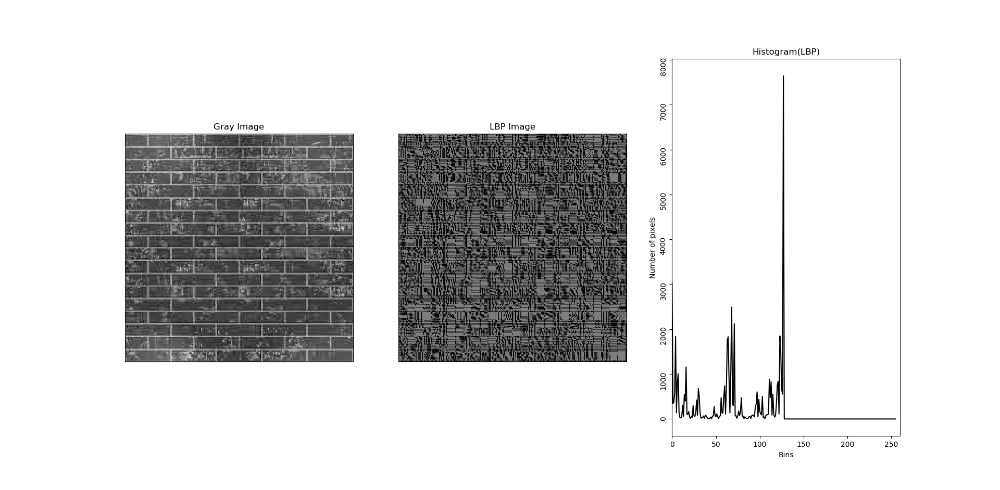
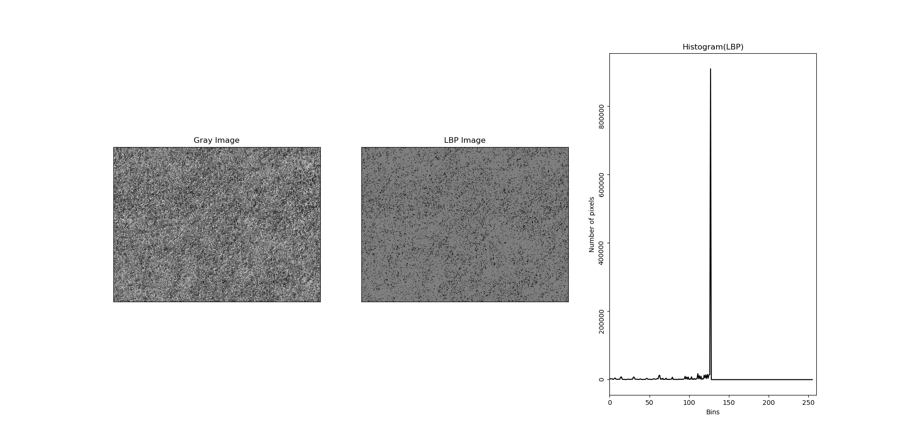
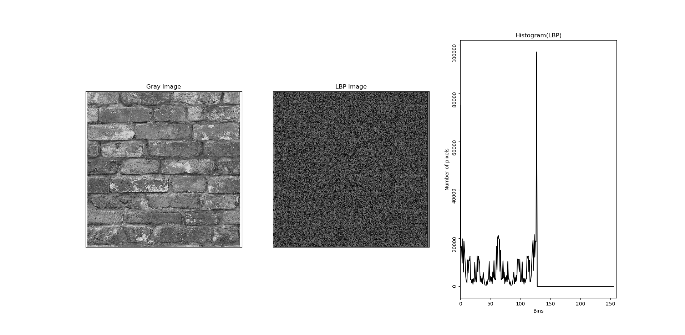

# Local Binary Patterns implementation using Python 3

`Local Binary Pattern (LBP)` is a simple yet very efficient texture operator which labels the pixels of an image by thresholding the neighborhood of each pixel and considers the result as a binary number. 
[Click here to learn more.](http://www.scholarpedia.org/article/Local_Binary_Patterns "Local Binary Pattern (LBP)")

Moreover, I also added a pattern code for two bins only to compare the result of LBP and two bin pattern.

## Packages Used
The program is coded using Windows 10 (64 bit) operating system with Python version 3.5.2.

The following packages are necessary to run the program:

Package | Version | Installation
--- | --- | ---
**OpenCV** | 3.2.0 | `pip install opencv-python`
**Numpy** | 1.11.3 | `pip install numpy`
**Matplotlib** | 1.5.3 | `pip install matplotlib`

### Output of `lbp.py`
The output consists of the gray scale image, LBP representation image and LBP histogram.
  
  
  

### References
* [Local Binary Patterns with Python & OpenCV](http://www.pyimagesearch.com/2015/12/07/local-binary-patterns-with-python-opencv/ "Local Binary Patterns with Python & OpenCV")
* [Local Binary Patterns Wiki](https://en.wikipedia.org/wiki/Local_binary_patterns "Local Binary Patterns Wiki")
* [Local Binary Patterns - Scholarpedia](http://www.scholarpedia.org/article/Local_Binary_Patterns)
* [Ahonen, T., et al. (2006). "Face description with local binary patterns: Application to face recognition." IEEE Transactions on Pattern Analysis & Machine Intelligence(12): 2037-2041.](http://citeseerx.ist.psu.edu/viewdoc/download?doi=10.1.1.456.1094&rep=rep1&type=pdf)
* [Ojala, T., et al. (2002). "Multiresolution gray-scale and rotation invariant texture classification with local binary patterns." IEEE Transactions on pattern analysis and machine intelligence 24(7): 971-987.](https://ieeexplore.ieee.org/iel5/34/21893/01017623.pdf)
* [Accessed 02, December, 2018. “Advanced-Image-Processing/parkjoonsuu/Advanced-Image-Processing/00_seminar_LBP,” https://github.com/parkjoonsuu/Advanced-Image-Processing/tree/master/00_seminar_LBP](https://github.com/parkjoonsuu/Advanced-Image-Processing/tree/master/00_seminar_LBP)
* [Liao, S., Zhu, X., Lei, Z., Zhang, L., & Li, S. Z. (2007, August). "Learning multi-scale block local binary patterns for face recognition," In International Conference on Biometrics (pp. 828-837). Springer, Berlin, Heidelberg.](https://link.springer.com/content/pdf/10.1007%2F978-3-540-74549-5_87.pdf)
